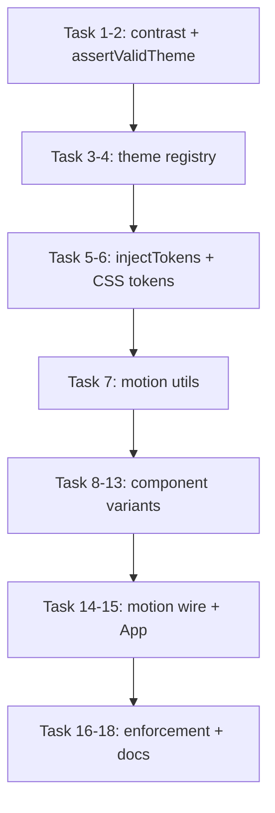

# Town 77 — Phase 3.5: Design System Implementation (TDD)

> **For agentic workers:** REQUIRED SUB-SKILL: Use superpowers:subagent-driven-development (recommended) or superpowers:executing-plans to implement this plan task-by-task. Steps use checkbox (`- [ ]`) syntax for tracking.

**Goal:** Complete Phase 3.5 by implementing the design system in code — theme registry, full token injection, component variant APIs, motion utilities, and accessibility foundations — using strict Red/Green/Refactor TDD on every task.

**Architecture:** Keep existing meta-tests (`spec-structure`, `tokens`, etc.) as **doc-regression** guards. Add new **implementation tests** that assert runtime behavior. Each component variant is added behind optional props with defaults matching today's behavior (backward compatible). Motion lives in `lib/motion.ts` and reads `animationPreset` from `ThemeContext`; components consume motion via small helpers, not inline Framer config. No game screens, no socket wiring.

**Tech Stack:** React 18, Framer Motion 11, Vitest 2, @testing-library/react 16, jsdom, existing `@town77/shared-types` Theme interface

**Spec references:**
- `docs/design-system/spec-theme-and-voice.md` (§3 tokens, §5 motion, §8 components, §9 theme authoring, §11 review)
- Completion criteria from Phase 3.5 analysis (2026-06-10)

---

## TDD Rules for This Phase

1. **Never write implementation before a failing test exists** for that behavior.
2. **One commit per green task** (or per logical sub-task where noted).
3. **Run the narrowest test file first** (`pnpm test -- path/to/file.test.ts`), then full client suite.
4. **Defaults preserve Phase 3 behavior** — existing tests must not break when adding optional props.
5. **Meta-tests stay green** — they validate docs; implementation tests validate code.

```bash
# From monorepo root
cd packages/client && pnpm test -- src/__tests__/themes/themes-index.test.ts

# Full client + engine (server excluded from workspace)
cd /path/to/town77 && pnpm test
```

---

## File Map

```
packages/client/src/
├── lib/
│   ├── theme.ts              # MODIFY: full injectTokens, getThemeById usage
│   ├── motion.ts             # CREATE: preset helpers, useReducedMotion
│   └── contrast.ts           # CREATE: WCAG contrast utilities (shared by tests + themes)
├── themes/
│   ├── index.ts              # CREATE: THEMES registry, getThemeById, ThemeId type
│   ├── town77.ts             # MODIFY: optional text colors if added to Theme
│   ├── playful-pastel.ts     # MODIFY: same
│   └── _template.ts          # MODIFY: align with final Theme shape
├── styles/
│   └── tokens.css            # MODIFY: Layer 3 component tokens
├── components/
│   ├── Chip.tsx              # MODIFY: size, variant, motion
│   ├── Cell.tsx              # MODIFY: density, highlightStyle, motion
│   ├── Grid.tsx              # MODIFY: density propagation
│   ├── Hand.tsx              # MODIFY: layoutMode
│   ├── ActionBar.tsx         # MODIFY: size, variant, iconOnly, i18n
│   └── PlayerBadge.tsx       # MODIFY: size, variant
├── __tests__/
│   ├── helpers/
│   │   ├── contrast.ts       # CREATE: re-export or duplicate for tests only
│   │   └── theme-assertions.ts  # CREATE: assertValidTheme(theme)
│   ├── themes/
│   │   ├── themes-index.test.ts
│   │   ├── town77.test.ts
│   │   └── playful-pastel.test.ts
│   ├── lib/
│   │   ├── inject-tokens.test.ts
│   │   └── motion.test.ts
│   ├── Chip.variants.test.tsx
│   ├── Cell.variants.test.tsx
│   ├── Grid.variants.test.tsx
│   ├── Hand.variants.test.tsx
│   ├── ActionBar.variants.test.tsx
│   └── PlayerBadge.variants.test.tsx
docs/design-system/
├── spec-theme-and-voice.md   # MODIFY: status → Approved (final task)
└── README.md                 # MODIFY: status aligned
```

---

## Task 1: Contrast utilities (pure functions, TDD)

**Files:**
- Create: `packages/client/src/lib/contrast.ts`
- Create: `packages/client/src/__tests__/lib/contrast.test.ts`

- [ ] **Step 1.1: Write failing tests**

```typescript
// packages/client/src/__tests__/lib/contrast.test.ts
import { describe, it, expect } from 'vitest'
import { contrastRatio, meetsWcagAA } from '../../lib/contrast'

describe('contrast', () => {
  it('returns ~21:1 for black on white', () => {
    expect(contrastRatio('#000000', '#ffffff')).toBeCloseTo(21, 0)
  })

  it('meetsWcagAA returns true at 4.5:1', () => {
    expect(meetsWcagAA('#ffffff', '#000000')).toBe(true)
  })

  it('meetsWcagAA returns false below 4.5:1', () => {
    expect(meetsWcagAA('#888888', '#999999')).toBe(false)
  })
})
```

- [ ] **Step 1.2: Run — expect FAIL**

```bash
cd packages/client && pnpm test -- src/__tests__/lib/contrast.test.ts
```

Expected: `Cannot find module '../../lib/contrast'`

- [ ] **Step 1.3: Implement `contrast.ts`** (extract logic from `asset-requirements.test.ts`)

- [ ] **Step 1.4: Run — expect PASS**

- [ ] **Step 1.5: Commit**

```bash
git add packages/client/src/lib/contrast.ts packages/client/src/__tests__/lib/contrast.test.ts
git commit -m "feat(client): utilidades WCAG contrast para validación de temas"
```

---

## Task 2: Theme assertion helper (TDD)

**Files:**
- Create: `packages/client/src/__tests__/helpers/theme-assertions.ts`
- Create: `packages/client/src/__tests__/themes/theme-assertions.test.ts`

- [ ] **Step 2.1: Write failing test**

```typescript
import { describe, it, expect } from 'vitest'
import { town77Theme } from '../../themes/town77'
import { assertValidTheme } from '../helpers/theme-assertions'

describe('assertValidTheme', () => {
  it('passes for town77Theme', () => {
    expect(() => assertValidTheme(town77Theme)).not.toThrow()
  })

  it('throws when shapes count is not 7', () => {
    const bad = { ...town77Theme, shapes: { cottage: 'M0 0' } }
    expect(() => assertValidTheme(bad as typeof town77Theme)).toThrow(/7 shapes/)
  })
})
```

- [ ] **Step 2.2: Run — expect FAIL**

- [ ] **Step 2.3: Implement `assertValidTheme`**

Validates: 7 shapes, 7 colors, 6 surfaces, all 6 animationPreset keys, non-empty SVG paths, each chip color `meetsWcagAA` vs `surfaces.cell` and `surfaces.cellValid`.

- [ ] **Step 2.4: Run — expect PASS**

- [ ] **Step 2.5: Commit**

```bash
git commit -m "feat(client): helper assertValidTheme para validación de temas"
```

---

## Task 3: Theme registry `themes/index.ts` (TDD)

**Files:**
- Create: `packages/client/src/themes/index.ts`
- Create: `packages/client/src/__tests__/themes/themes-index.test.ts`

- [ ] **Step 3.1: Write failing tests**

```typescript
import { describe, it, expect } from 'vitest'
import { THEMES, getThemeById, type ThemeId } from '../../themes'
import { assertValidTheme } from '../helpers/theme-assertions'

describe('themes index', () => {
  it('exports at least town77 and playful-pastel', () => {
    const ids = THEMES.map((t) => t.id)
    expect(ids).toContain('town77')
    expect(ids).toContain('playful-pastel')
  })

  it('getThemeById returns theme for valid id', () => {
    expect(getThemeById('town77').id).toBe('town77')
  })

  it('getThemeById throws for unknown id', () => {
    expect(() => getThemeById('nope' as ThemeId)).toThrow()
  })

  it('every registered theme passes assertValidTheme', () => {
    THEMES.forEach((t) => assertValidTheme(t))
  })
})
```

- [ ] **Step 3.2: Run — expect FAIL**

- [ ] **Step 3.3: Implement `themes/index.ts`**

```typescript
import type { Theme } from '@town77/shared-types'
import { town77Theme } from './town77'
import { playfulPastelTheme } from './playful-pastel'

export type ThemeId = 'town77' | 'playful-pastel'

export const THEMES: readonly Theme[] = [town77Theme, playfulPastelTheme] as const

const byId = new Map(THEMES.map((t) => [t.id, t]))

export function getThemeById(id: ThemeId): Theme {
  const theme = byId.get(id)
  if (!theme) throw new Error(`Unknown theme: ${id}`)
  return theme
}
```

- [ ] **Step 3.4: Run — expect PASS** (may fail contrast until playful-pastel palette adjusted — fix theme data, not tests)

- [ ] **Step 3.5: Commit**

```bash
git commit -m "feat(client): registro de temas THEMES y getThemeById"
```

---

## Task 4: Per-theme tests (TDD)

**Files:**
- Create: `packages/client/src/__tests__/themes/town77.test.ts`
- Create: `packages/client/src/__tests__/themes/playful-pastel.test.ts`

- [ ] **Step 4.1: Write failing tests** (thin wrappers calling `assertValidTheme` + theme-specific assertions)

```typescript
// town77.test.ts
import { describe, it } from 'vitest'
import { town77Theme } from '../../themes/town77'
import { assertValidTheme } from '../helpers/theme-assertions'

describe('town77 theme', () => {
  it('is a valid theme', () => assertValidTheme(town77Theme))
  it('uses playful spring preset (stiffness 260)', () => {
    expect(town77Theme.animationPreset.chipPlace.stiffness).toBe(260)
  })
})
```

- [ ] **Step 4.2: Run — expect FAIL** if playful-pastel contrast fails

- [ ] **Step 4.3: Fix theme data** until both themes pass WCAG on required surfaces

- [ ] **Step 4.4: Run — expect PASS**

- [ ] **Step 4.5: Commit**

```bash
git commit -m "test(client): validación estructural y contraste por tema"
```

---

## Task 5: Extended `injectTokens` — text + motion semantics (TDD)

**Files:**
- Modify: `packages/client/src/lib/theme.ts`
- Create: `packages/client/src/__tests__/lib/inject-tokens.test.ts`

- [ ] **Step 5.1: Write failing tests** (extend beyond existing `theme.test.ts` or new file)

```typescript
import { beforeEach, describe, expect, it } from 'vitest'
import { injectTokens } from '../../lib/theme'
import { town77Theme } from '../../themes/town77'

describe('injectTokens — motion semantics', () => {
  beforeEach(() => document.documentElement.removeAttribute('style'))

  it('sets --motion-chip-place-stiffness from animationPreset', () => {
    injectTokens(town77Theme)
    expect(document.documentElement.style.getPropertyValue('--motion-chip-place-stiffness')).toBe('260')
  })

  it('sets --motion-chip-invalid-duration', () => {
    injectTokens(town77Theme)
    expect(document.documentElement.style.getPropertyValue('--motion-chip-invalid-duration')).toBe('0.3')
  })

  it('sets default text semantics when theme has no text field', () => {
    injectTokens(town77Theme)
    expect(document.documentElement.style.getPropertyValue('--color-text-primary')).not.toBe('')
  })
})
```

- [ ] **Step 5.2: Run — expect FAIL**

- [ ] **Step 5.3: Implement** motion + text injection in `injectTokens()`

Use defaults for text colors matching `tokens.css` when not on theme object (YAGNI: optional `text?: { primary, secondary, accent }` on Theme only if playful-pastel needs different values).

- [ ] **Step 5.4: Run — expect PASS** (existing `theme.test.ts` + new file)

- [ ] **Step 5.5: Commit**

```bash
git commit -m "feat(client): injectTokens — semántica de texto y motion"
```

---

## Task 6: Component-level tokens in CSS (TDD)

**Files:**
- Modify: `packages/client/src/styles/tokens.css`
- Modify: `packages/client/src/__tests__/tokens.test.ts` (add Layer 3 assertions)

- [ ] **Step 6.1: Add failing test**

```typescript
it('defines component-level chip tokens', () => {
  expect(tokensContent).toContain('--chip-size')
  expect(tokensContent).toContain('var(--layout-cell)')
})
```

- [ ] **Step 6.2: Run — expect FAIL**

- [ ] **Step 6.3: Add Layer 3 tokens** per spec §3 (chip, cell, button)

- [ ] **Step 6.4: Run — expect PASS**

- [ ] **Step 6.5: Commit**

```bash
git commit -m "feat(client): tokens CSS capa 3 — componentes"
```

---

## Task 7: Motion utilities (TDD)

**Files:**
- Create: `packages/client/src/lib/motion.ts`
- Create: `packages/client/src/__tests__/lib/motion.test.ts`

- [ ] **Step 7.1: Write failing tests**

```typescript
import { describe, it, expect, vi, beforeEach, afterEach } from 'vitest'
import { chipPlaceTransition, chipInvalidTransition, prefersReducedMotion } from '../../lib/motion'
import { town77Theme } from '../../themes/town77'

describe('motion utils', () => {
  it('chipPlaceTransition returns spring from preset', () => {
    const t = chipPlaceTransition(town77Theme.animationPreset)
    expect(t.type).toBe('spring')
    expect(t.stiffness).toBe(260)
  })

  it('chipInvalidTransition returns x keyframes from preset', () => {
    const t = chipInvalidTransition(town77Theme.animationPreset)
    expect(t.x).toEqual([-6, 6, -4, 4, 0])
  })

  describe('prefersReducedMotion', () => {
    afterEach(() => vi.restoreAllMocks())
    it('returns true when matchMedia prefers reduced motion', () => {
      vi.spyOn(window, 'matchMedia').mockReturnValue({ matches: true } as MediaQueryList)
      expect(prefersReducedMotion()).toBe(true)
    })
  })
})
```

- [ ] **Step 7.2: Run — expect FAIL**

- [ ] **Step 7.3: Implement `motion.ts`**

Export: `chipPlaceTransition`, `chipInvalidTransition`, `cellPulseTransition`, `useReducedMotion()` hook, `resolveTransition(preset, transition)` that returns `{ duration: 0 }` when reduced motion.

- [ ] **Step 7.4: Run — expect PASS**

- [ ] **Step 7.5: Commit**

```bash
git commit -m "feat(client): utilidades motion — presets y reduced-motion"
```

---

## Task 8: Chip variants (TDD)

**Files:**
- Modify: `packages/client/src/components/Chip.tsx`
- Create: `packages/client/src/__tests__/Chip.variants.test.tsx`

- [ ] **Step 8.1: Write failing tests**

```tsx
import { describe, it, expect } from 'vitest'
import { screen } from '@testing-library/react'
import { Chip } from '../components/Chip'
import { renderWithTheme } from './helpers'

const chip = { color: 'color-1', shape: 'cottage' }

describe('Chip variants', () => {
  it('defaults to data-size md', () => {
    renderWithTheme(<Chip chip={chip} isSelected={false} isValid />)
    expect(screen.getByTestId('chip-color-1-cottage')).toHaveAttribute('data-size', 'md')
  })

  it('sets data-size lg', () => {
    renderWithTheme(<Chip chip={chip} isSelected={false} isValid size="lg" />)
    expect(screen.getByTestId('chip-color-1-cottage')).toHaveAttribute('data-size', 'lg')
  })

  it('outline variant uses stroke without fill', () => {
    renderWithTheme(<Chip chip={chip} isSelected={false} isValid variant="outline" />)
    expect(screen.getByTestId('chip-color-1-cottage')).toHaveAttribute('data-variant', 'outline')
  })
})
```

- [ ] **Step 8.2: Run — expect FAIL**

- [ ] **Step 8.3: Implement** optional `size?: 'sm' | 'md' | 'lg'`, `variant?: 'flat' | 'outline'`

Use `data-size` / `data-variant` attributes + CSS variables (`calc(var(--layout-cell) * 0.6)` etc.). Refactor hardcoded `#888888` fallback to `var(--color-text-secondary)`.

- [ ] **Step 8.4: Run Chip.test.tsx + Chip.variants.test.tsx — expect PASS**

- [ ] **Step 8.5: Commit**

```bash
git commit -m "feat(client): Chip — variantes size y outline con TDD"
```

---

## Task 9: Cell variants (TDD)

**Files:**
- Modify: `packages/client/src/components/Cell.tsx`
- Create: `packages/client/src/__tests__/Cell.variants.test.tsx`

- [ ] **Step 9.1: Write failing tests**

```tsx
describe('Cell variants', () => {
  it('compact density sets data-density compact', () => {
    renderWithTheme(<Cell row={0} col={0} chip={null} isValid density="compact" />)
    expect(screen.getByTestId('cell-0-0')).toHaveAttribute('data-density', 'compact')
  })

  it('pulse highlight sets data-highlight pulse when valid', () => {
    renderWithTheme(
      <Cell row={0} col={0} chip={null} isValid highlightStyle="pulse" />,
    )
    expect(screen.getByTestId('cell-0-0')).toHaveAttribute('data-highlight', 'pulse')
  })
})
```

- [ ] **Step 9.2–9.5:** RED → GREEN → commit

```bash
git commit -m "feat(client): Cell — variantes density y highlightStyle"
```

Migrate cell background from `theme.surfaces.*` to CSS vars where possible.

---

## Task 10: Grid density propagation (TDD)

**Files:**
- Modify: `packages/client/src/components/Grid.tsx`
- Create: `packages/client/src/__tests__/Grid.variants.test.tsx`

- [ ] **Step 10.1: Test that `density="compact"` sets `data-density` on grid and child cells**

- [ ] **Step 10.2–10.5:** RED → GREEN → commit

```bash
git commit -m "feat(client): Grid — propagación de density a celdas"
```

---

## Task 11: Hand layoutMode (TDD)

**Files:**
- Modify: `packages/client/src/components/Hand.tsx`
- Create: `packages/client/src/__tests__/Hand.variants.test.tsx`

- [ ] **Step 11.1: Tests for `layoutMode` scrolling (default), stacked, compact**

```tsx
it('stacked mode enables flex-wrap', () => {
  renderWithTheme(<Hand chips={chips} selectedChip={null} onSelect={() => {}} layoutMode="stacked" />)
  expect(screen.getByTestId('hand')).toHaveStyle({ flexWrap: 'wrap' })
})
```

- [ ] **Step 11.2–11.5:** RED → GREEN → commit

```bash
git commit -m "feat(client): Hand — layoutMode scrolling, stacked, compact"
```

---

## Task 12: ActionBar variants + i18n (TDD)

**Files:**
- Modify: `packages/client/src/components/ActionBar.tsx`
- Create: `packages/client/src/__tests__/ActionBar.variants.test.tsx`
- Modify: `packages/client/src/__tests__/helpers.tsx` — wrap with `I18nextProvider` variant if needed

- [ ] **Step 12.1: Write failing tests**

```tsx
import i18n from '../lib/i18n'

describe('ActionBar variants', () => {
  beforeAll(async () => { await i18n.changeLanguage('en') })

  it('renders English labels via i18n', () => {
    renderWithTheme(<ActionBar canExchange canDiscard onExchange={() => {}} onDiscard={() => {}} />)
    expect(screen.getByTestId('btn-exchange')).toHaveTextContent('Exchange')
  })

  it('ghost variant sets data-variant ghost', () => {
    renderWithTheme(
      <ActionBar canExchange canDiscard variant="ghost" onExchange={() => {}} onDiscard={() => {}} />,
    )
    expect(screen.getByTestId('btn-exchange')).toHaveAttribute('data-variant', 'ghost')
  })

  it('sm size sets data-size sm on buttons', () => { /* ... */ })
})
```

- [ ] **Step 12.2–12.5:** RED → GREEN → commit

Replace hardcoded strings with `useTranslation('game')` for `exchange` / `discard`.

```bash
git commit -m "feat(client): ActionBar — variantes, i18n y tamaños"
```

---

## Task 13: PlayerBadge variants (TDD)

**Files:**
- Modify: `packages/client/src/components/PlayerBadge.tsx`
- Create: `packages/client/src/__tests__/PlayerBadge.test.tsx`

- [ ] **Step 13.1: Tests for `size`, `variant`, `data-active` on current turn**

- [ ] **Step 13.2–13.5:** RED → GREEN → commit

```bash
git commit -m "feat(client): PlayerBadge — variantes size y compact"
```

---

## Task 14: Wire motion into Chip (TDD)

**Files:**
- Modify: `packages/client/src/components/Chip.tsx`
- Extend: `packages/client/src/__tests__/Chip.variants.test.tsx`

- [ ] **Step 14.1: Test that Chip renders `motion.button` when reduced motion is false**

Mock `prefersReducedMotion` → false; assert component mounts (smoke). With reduced motion → no x animation props applied (test via `resolveTransition` unit tests already cover logic; component test verifies no throw).

- [ ] **Step 14.2: Implement** `motion.button` with `chipPlaceTransition` on layout, optional shake when `isValid={false}` and clicked

- [ ] **Step 14.3: Run all Chip tests — PASS**

- [ ] **Step 14.4: Commit**

```bash
git commit -m "feat(client): Chip — animaciones Framer Motion con reduced-motion"
```

---

## Task 15: App uses theme registry (smoke TDD)

**Files:**
- Modify: `packages/client/src/App.tsx`
- Extend: `packages/client/src/__tests__/App.test.tsx`

- [ ] **Step 15.1: Test that App initializes with `getThemeById('town77')`**

- [ ] **Step 15.2: Refactor App to import from `themes/index`**

- [ ] **Step 15.3: Run App.test.tsx — PASS**

- [ ] **Step 15.4: Commit**

```bash
git commit -m "refactor(client): App usa registro de temas"
```

---

## Task 16: Enforce WCAG in asset-requirements test (TDD tighten)

**Files:**
- Modify: `packages/client/src/__tests__/asset-requirements.test.ts`

- [ ] **Step 16.1: Change contrast test from "ratio > 0" to `meetsWcagAA` for town77 colors**

- [ ] **Step 16.2: Run — fix any failing theme colors**

- [ ] **Step 16.3: Commit**

```bash
git commit -m "test(client): exigir WCAG AA en colores de ficha"
```

---

## Task 17: No hardcoded colors lint test (TDD guard)

**Files:**
- Create: `packages/client/src/__tests__/design-tokens-enforcement.test.ts`

- [ ] **Step 17.1: Test scans `src/components/*.tsx` for `#[0-9a-fA-F]{3,6}` outside allowed patterns**

Allowlist: `#000`, `#111`, `#fff` in ActionBar contrast pairs if needed — prefer tokens.

- [ ] **Step 17.2: Fix violations found**

- [ ] **Step 17.3: Commit**

```bash
git commit -m "test(client): guardia contra colores hardcodeados en componentes"
```

---

## Task 18: Documentation closeout

**Files:**
- Modify: `docs/design-system/spec-theme-and-voice.md` — status Approved
- Modify: `docs/design-system/README.md` — status aligned
- Modify: `packages/client/src/themes/_template.ts` — final field list

- [ ] **Step 18.1: Run full verification**

```bash
pnpm test
cd packages/client && pnpm typecheck && pnpm build
```

Expected: all meta-tests + implementation tests pass; build succeeds.

- [ ] **Step 18.2: Commit**

```bash
git commit -m "docs: Phase 3.5 completa — design system implementado"
```

---

## Phase 3.5 Complete

At this point:

| Area | Delivered |
|------|-----------|
| Theme registry | `THEMES`, `getThemeById`, per-theme validation tests |
| Tokens | Full `injectTokens`, Layer 3 CSS tokens |
| Components | All §8 variants with RTL tests |
| Motion | `lib/motion.ts`, reduced-motion, Chip animation |
| i18n | ActionBar uses `t()` |
| Tests | Doc-regression (existing) + implementation (~80–100 new tests) |
| Accessibility | WCAG enforced in theme tests, focus preserved |

**Explicitly NOT delivered (Phase 4+):**
- Config theme picker UI
- Sound bank / Howler
- `public/themes/*.json` runtime loading
- Storybook
- Game screen socket integration
- Celebrate particles triggered by gameplay

**Next:** Phase 4 — Client Screens (`docs/superpowers/plans/` — to be written), building on stable component APIs.

---

## Execution Order (Waves)



Tasks 8–13 can run **in parallel** once Task 7 is green (independent components).

---

## Risk Notes

1. **playful-pastel contrast** — likely fails WCAG on some pastels; adjust palette in theme file, document rationale in comment.
2. **Framer Motion in tests** — use unit tests on pure `motion.ts` functions; component tests assert attributes, not animation frames.
3. **Backward compatibility** — run full client suite after each component task; Phase 3 tests must stay green.
4. **shared-types changes** — avoid unless necessary; prefer optional `text` on Theme or derived defaults in `injectTokens`.
